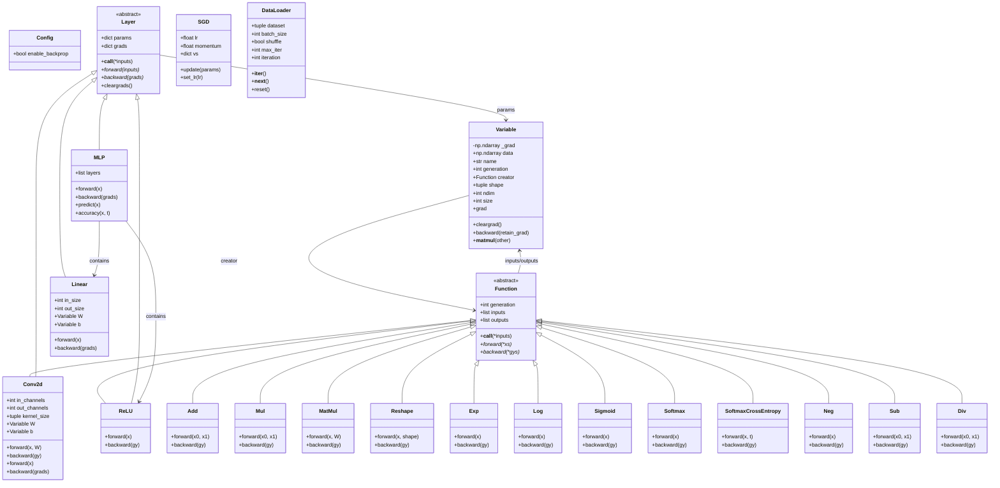

# DPTiny

A minimal implementation of a deep learning framework for educational purposes.

## Features

- Automatic differentiation (autograd) system
- Basic mathematical operations with operator overloading
- Convolution layer with learnable kernels
- NumPy-based computation
- Optional GPU acceleration via CuPy

## Installation

```bash
pip install -e .
```

For GPU acceleration install the matching CuPy wheel for your CUDA version, e.g.:

```bash
pip install -e ".[gpu]"
# or explicitly, e.g. for CUDA 12.x:
pip install cupy-cuda12x
```

## GPU Usage

DPTiny can transparently run on an NVIDIA GPU when CuPy is installed.
Enable the GPU backend and move your data to the device before training:

```python
from dptiny import use_gpu, to_gpu, Variable, MLP, get_mnist, DataLoader

use_gpu()  # raises RuntimeError if CuPy/CUDA is unavailable

X_train, X_test, y_train, y_test = get_mnist()
X_train = to_gpu(X_train.astype("float32"))
y_train = to_gpu(y_train)

model = MLP(784, [100, 100], 10)
```

All framework operations (autograd, layers, optimizers) then execute on the GPU
using the same NumPy-like API.

See `examples/mnist_gpu.py` for a complete GPU training example.

## Convolution Example

```python
import numpy as np
from dptiny import Variable, Conv2d

x = Variable(np.random.randn(8, 1, 28, 28).astype(np.float32))
conv = Conv2d(in_channels=1, out_channels=16, kernel_size=3, pad=1)
y = conv(x)
print(y.shape)  # (8, 16, 28, 28)
```

See `examples/conv_example.py` for a runnable example.

## Usage Example

```python
import numpy as np
from dptiny import Variable

# Create variables
x = Variable(np.array(2.0))
y = Variable(np.array(3.0))

# Perform operations
z = x * y
print(z.data)  # 6.0

# Compute gradients
z.backward()
print(x.grad)  # 3.0
print(y.grad)  # 2.0
```

## Architecture



An interactive HTML visualization of this architecture and the compute graph is
available at [`docs/architecture.html`](docs/architecture.html).

## Requirements

- NumPy
- Optional: CuPy for GPU acceleration
