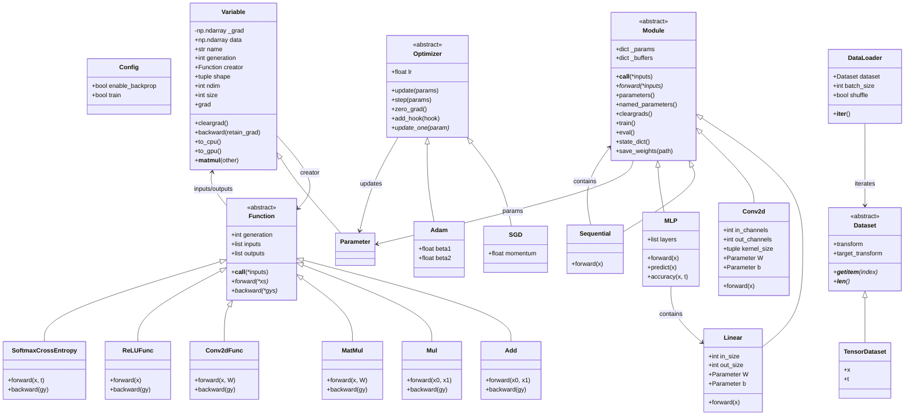

# DPTiny

A minimal implementation of a deep learning framework for educational purposes,
structured in the style of PyTorch/DeZero.

## Features

- Automatic differentiation (autograd) with a generation-ordered compute graph
- `Variable`/`Function`/`Parameter` core with operator overloading
- `Module` system (`dptiny.nn`): auto-registered parameters, `Sequential`,
  `MLP`, `Linear`, `Conv2d`, pooling, `Flatten`, `Dropout`, `BatchNorm`,
  activations, `state_dict`/`save_weights`
- Optimizers (`dptiny.optim`): `SGD` (+momentum), `Adam`, `AdamW`, `RMSprop`,
  `WeightDecay`/`ClipGrad` hooks, and `StepLR`/`ExponentialLR`/
  `CosineAnnealingLR` schedulers
- Data utilities (`dptiny.data`): `Dataset`, `TensorDataset`, `DataLoader`,
  MNIST, and transforms
- NumPy-based computation with optional GPU acceleration via CuPy
- Test suite with numerical gradient checking (`pytest`)

## Installation

```bash
pip install -e .
```

For GPU acceleration install the matching CuPy wheel for your CUDA version:

```bash
pip install -e ".[gpu]"
# or explicitly, e.g. for CUDA 12.x:
pip install cupy-cuda12x
```

For development (tests + linting):

```bash
pip install -e ".[dev]"
```

## Quick start

```python
import numpy as np
from dptiny import (
    Variable, get_mnist, no_grad, softmax_cross_entropy, test_mode,
)
from dptiny.data import DataLoader
from dptiny.nn import (
    Conv2d, Dropout, Flatten, Linear, MaxPool2d, ReLU, Sequential,
)
from dptiny.optim import Adam

X_train, X_test, y_train, y_test = get_mnist(flatten=False)

model = Sequential(
    Conv2d(1, 16, 3, pad=1), ReLU(), MaxPool2d(2),
    Conv2d(16, 32, 3, pad=1), ReLU(), MaxPool2d(2),
    Flatten(),
    Linear(32 * 7 * 7, 128), ReLU(), Dropout(0.3),
    Linear(128, 10),
)
optimizer = Adam(model, lr=0.001)
train_loader = DataLoader((X_train, y_train), batch_size=128)

for x, t in train_loader:
    y = model(Variable(x))
    loss = softmax_cross_entropy(y, t)
    model.cleargrads()
    loss.backward()
    optimizer.update()
    break  # one step shown for brevity

# Evaluate (Dropout/BatchNorm switch off in test mode)
with test_mode(), no_grad():
    pred = model(Variable(X_test[:8])).data.argmax(axis=1)

model.save_weights("cnn_weights.npz")   # load with model.load_weights(...)
```

The classic flat imports still work, so older scripts keep running unchanged:

```python
from dptiny import MLP, SGD, Conv2d, Linear, DataLoader, get_mnist
# dptiny.layers / dptiny.datasets also remain as compatibility shims
```

See `examples/` for full training scripts: `mnist.py` (MLP, CPU),
`mnist_gpu.py` (MLP, GPU), `mnist_cnn.py` (CNN, ~98.5% in 2 epochs),
`conv_example.py`, `matmul_example.py`.

## GPU Usage

DPTiny can transparently run on an NVIDIA GPU when CuPy is installed.
Enable the GPU backend and move your data to the device before training:

```python
from dptiny import use_gpu, to_gpu, is_gpu, Variable, MLP, get_mnist

use_gpu()  # raises RuntimeError if CuPy/CUDA is unavailable

X_train, X_test, y_train, y_test = get_mnist()
X_train = to_gpu(X_train.astype("float32"))
y_train = to_gpu(y_train)

model = MLP(784, [100, 100], 10)
model.to_gpu()  # moves every registered parameter (and buffer) to the GPU
```

All framework operations (autograd, layers, optimizers) then execute on the GPU
using the same NumPy-like API. `Variable`s and `Module`s expose `to_gpu()` /
`to_cpu()` for explicit transfers.

See `examples/mnist_gpu.py` and `examples/mnist_cnn.py` for complete examples.

## Convolution Example

```python
import numpy as np
from dptiny import Variable
from dptiny.nn import Conv2d

x = Variable(np.random.randn(8, 1, 28, 28).astype(np.float32))
conv = Conv2d(in_channels=1, out_channels=16, kernel_size=3, pad=1)
y = conv(x)
print(y.shape)  # (8, 16, 28, 28)
```

`Conv2d` layers register `W`/`b` parameters automatically and compose with
`MaxPool2d`/`AvgPool2d`/`Flatten` inside `Sequential`. See
`examples/conv_example.py` for a runnable example.

## Usage Example

```python
import numpy as np
from dptiny import Variable

# Create variables
x = Variable(np.array(2.0))
y = Variable(np.array(3.0))

# Perform operations
z = x * y
print(z.data)  # 6.0

# Compute gradients
z.backward()
print(x.grad)  # 3.0
print(y.grad)  # 2.0
```

## Architecture



An interactive HTML visualization of this architecture and the compute graph is
available at [`docs/architecture.html`](docs/architecture.html).

## Development

```bash
pip install -e ".[dev]"
ruff check dptiny tests examples
pytest -q
```

The test suite includes numerical gradient checking (`dptiny.utils.gradient_check`)
for every differentiable op, plus GPU tests that are skipped automatically when
CuPy is not installed.

## Requirements

- Python >= 3.9
- NumPy
- scikit-learn (MNIST download)
- Optional: CuPy for GPU acceleration
